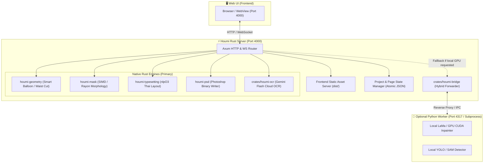

# 🦀 แผนการพัฒนา Phase 2 & 3: Standalone Rust Server พร้อม Hybrid Fallback Bridge สำหรับ Houmi

แผนงานนี้ต่อยอดจาก Phase 1 เพื่อทำให้ **`houmi-rust`** รองรับการทำงานจริงแบบ End-to-End โดยพัฒนาฟังก์ชันหลัก (Cloud OCR, Project Management, Pipeline Orchestration, Static UI Hosting) บน Rust ทั้งหมด พร้อมสร้างระบบ **Hybrid Fallback Bridge** เพื่อส่งต่องาน Deep Learning เฉพาะทางไปยัง Python Worker เมื่อจำเป็น

---

## 🏗️ Architecture & Hybrid Fallback Design

---

## 📦 โมดูลใหม่ที่จะเพิ่มใน Workspace

| Crate / Module | หน้าที่หลัก | รายละเอียดการทำงาน |
| :--- | :--- | :--- |
| **`crates/houmi-ocr`** | Native Gemini OCR & Translation Client | รองรับ Gemini 2.5/2.0 Flash, Key Rotation, Image Base64 Encoding, JSON Schema Parsing |
| **`crates/houmi-bridge`** | Hybrid Fallback & Subprocess Supervisor | ทำ Reverse Proxy ส่งต่อคำขอเฉพาะจุดไปยัง Python Worker เมื่อต้องการใช้ Local GPU โมเดลหนัก |
| **`houmi-server` (Expanded)** | Full REST API & Project Workspaces | รองรับ CRUD Projects, Page Asset Serving, Static UI Hosting (`dist/`), WebSocket Events |

---

## 📋 Phased Execution Plan (ตามข้อกำหนด GODKILLER Protocol)

### Phase 2 — Cloud OCR & LLM Translation Engine in Rust (`crates/houmi-ocr`)
- **เป้าหมาย:** สร้างตัวเชื่อมต่อ Gemini API ประสิทธิภาพสูงบน Rust รองรับการยิงพร้อมกันหลาย Blocks และหมุนเวียน Key อัตโนมัติ
- **สิ่งที่ดำเนินการ:**
  1. สร้าง Crate `crates/houmi-ocr` พร้อม `reqwest` (Async client + Connection pooling)
  2. Implement Gemini `generateContent` API รองรับ Image Parts (Base64) และ Structured JSON
  3. ระบบ Key Rotation & Exponential Backoff Retry เมื่อติด Rate Limit 429
  4. Unit Tests และ Mock Request Testing

### Phase 3 — Full REST API & Project Pipeline Endpoints (`crates/houmi-server`)
- **เป้าหมาย:** เพิ่ม REST Routes ใน `houmi-server` ให้รองรับการทำงานของ Web UI ครบถ้วน
- **สิ่งที่ดำเนินการ:**
  1. Project Management APIs: `GET /api/projects`, `POST /api/projects`, `GET /api/projects/:id`
  2. Page & Block APIs: `GET /api/pages/:id`, `POST /api/blocks/update`
  3. Pipeline APIs: `POST /api/pipeline/ocr`, `POST /api/pipeline/typeset`, `POST /api/export/psd`
  4. Static File Server: เสิร์ฟภาพหน้ากระดาษ, Masks, และ Web UI (`frontend/dist`) ผ่าน `tower-http::services::ServeDir`

### Phase 4 — Hybrid Fallback Bridge & Subprocess Proxy (`crates/houmi-bridge`)
- **เป้าหมาย:** เสริมความยืดหยุ่นด้วย Hybrid Mode เชื่อมต่อไปยัง Python เมื่อต้องการใช้โมเดลในเครื่อง
- **สิ่งที่ดำเนินการ:**
  1. สร้าง Crate `crates/houmi-bridge` เป็น Transparent HTTP Proxy
  2. Route สำหรับ `/api/inpaint/local` ให้ Forward หา Python Port 4317 อัตโนมัติ (ถ้าเปิดอยู่)
  3. หากไม่มี Python ให้ Fallback ใช้ Rust Morphology / Telea Mask แทนโดยไม่ Crash

### Phase 5 — Verification, End-to-End Test & Live Playtest
- **เป้าหมาย:** ทดสอบการเปิดใช้งานร่วมกับ Web UI จริง ตรวจสอบ Flow: โหลดโปรเจกต์ -> OCR -> Typeset -> Export PSD
- **สิ่งที่ดำเนินการ:**
  1. คอมไพล์ Release Binary
  2. ทดสอบยิง Request จำลองเต็มรูปแบบ
  3. บันทึกผลการทดสอบผ่าน `gk_verify.exit`
