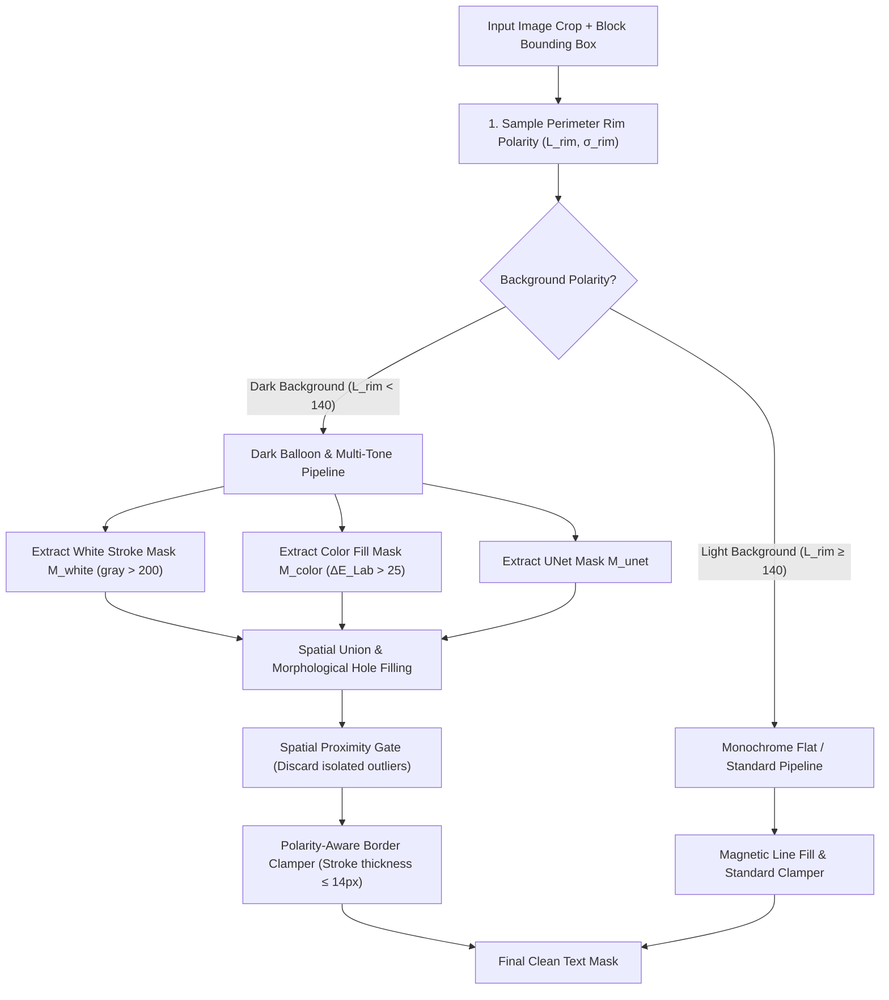

# Plan: Fix Mask Kernel for Dark / Spiky Speech Balloons with White-Outlined Text

## Goal
Eliminate text mask dropouts on dark/spiky screaming balloons with stylized fonts (e.g. pink fill + white outline on dark background with speedlines) and remove stray rectangular mask artifacts outside balloons, while maintaining 100% regression-free performance on standard white dialogue bubbles.

---

## Architecture Diagram

---

## Phases

### Phase 1 — Polarity-Aware Border Clamper & Background Stroke Discrimination
- **Files**:
  - `backend/app/services/mask/border_clamper.py`
  - `backend/tests/test_border_clamper_polarity.py`
- **Actions**:
  1. Add 3px perimeter rim polarity sampling in `clamp_mask_to_balloon_interior(mask, image_bgr, margin_px=2)`.
  2. Implement stroke thickness discrimination via distance transform ($distTransform(component) \le 14\text{px}$) to differentiate true balloon stroke boundaries from solid dark background artwork.
  3. Add $> 40\%$ over-coverage safeguard to prevent self-erasure of text masks on dark backgrounds.
  4. Create unit tests for `border_clamper.py` with both light and dark background fixtures.
- **DoD**:
  - `pytest backend/tests/test_border_clamper_polarity.py` passes 100%.

---

### Phase 2 — Multi-Tone & White-Outlined Text Segmentation on Dark/Spiky Backgrounds
- **Files**:
  - `backend/app/services/text_mask.py`
  - `backend/app/services/mask/classifier.py`
- **Actions**:
  1. In `text_mask.py`, enhance `_refine_line_mask` and `generate_adaptive_sfx_mask` to detect white outer strokes ($gray > 200$) combined with colored inner fills on dark backgrounds.
  2. Disable destructive background carving in `generate_manga_unet_text_mask` when white text strokes or light-on-dark text is detected.
  3. Apply morphological closing ($cv2.MORPH\_CLOSE$) and `fill_mask_holes` on fused multi-tone text components.
- **DoD**:
  - Synthetic and crop tests for white-outlined pink Korean text produce solid coverage over both the stroke and inner fill.

---

### Phase 3 — Spatial Proximity Gating & Stray Artifact Containment in Inpainter
- **Files**:
  - `backend/app/services/inpainter.py`
- **Actions**:
  1. Update `_clip_auto_mask_to_balloon` to enforce spatial proximity gating against the core OCR text proposals/bounding box.
  2. Reject candidate connected components that lie outside the core balloon polygon or $> 24\text{px}$ from text proposals.
  3. Eliminate stray rectangular mask artifacts outside the balloon area.
- **DoD**:
  - Mask generation produces zero mask outside the balloon perimeter or far beyond text lines.

---

### Phase 4 — End-to-End Test Suite & Zero-Regression Verification
- **Files**:
  - `backend/tests/test_dark_spiky_balloon_mask.py`
- **Actions**:
  1. Write end-to-end unit tests with synthetic spiky shout balloon and white-outlined text matching the user's uploaded image.
  2. Run full regression test suite across existing mask tests (`test_balloon_mask_boundary.py`, `test_magnetic_mask.py`, `test_text_mask.py`, `test_inpaint_mask_containment.py`).
- **DoD**:
  - All test suites pass with 0 regressions.
