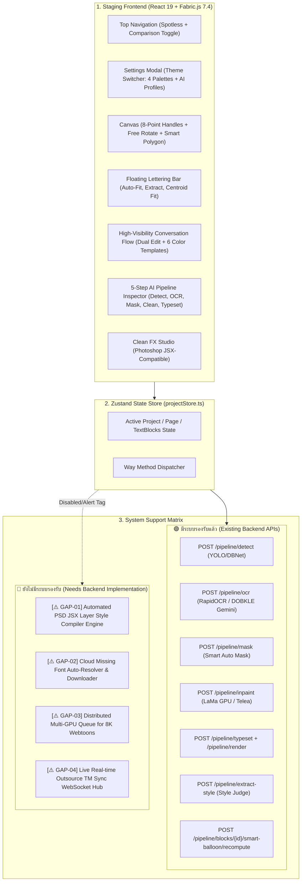

# GODKILLER Architectural Plan — Houmi Studio Staging Clone & System Gap Analysis

**GOAL:** สร้างและประกอบระบบ UX/UI Houmi Studio ใหม่บน Sandboxed Staging Clone (`e:\houmi\frontend_preview_staging\`) โดยเชื่อมต่อ Way Methods เข้ากับ Backend จริง วิเคราะห์แยกระบบที่มีอยู่แล้วกับระบบที่ยังไม่รองรับ พร้อมติดป้ายแจ้งเตือน `[⚠️ ยังไม่มีระบบรองรับ - ต้องการลงระบบ]` ให้ชัดเจน 100% โดยไม่กระทบโค้ดโปรเจ็คหลัก

---

## 0. Architecture & Data Flow Map

---

## 1. System Capability & Gap Analysis (ตารางแยกแยะระบบที่มีอยู่ vs ระบบที่ยังไม่รองรับ)

| ฟีเจอร์บน UX/UI ใหม่ | สถานะระบบใน Houmi Backend | รายละเอียดการเชื่อมต่อ / สิ่งที่ต้องแจ้งเตือน | การจัดการบน Staging UI |
|---|---|---|---|
| **1. Detect บอลลูน** | 🟢 **มีระบบรองรับแล้ว** | เชื่อมต่อ `POST /pipeline/detect` ผ่าน `balloon_detector` (YOLO DBNet) คืนค่า Bounding Box และ Confidence | เชื่อมต่อและรันได้จริง |
| **2. OCR อ่านข้อความ** | 🟢 **มีระบบรองรับแล้ว** | เชื่อมต่อ `POST /pipeline/ocr` (รองรับ RapidOCR, Gemini DOBKLE, VLM) คืนค่า `source_text` | เชื่อมต่อและรันได้จริง |
| **3. สร้าง Clean Mask** | 🟢 **มีระบบรองรับแล้ว** | เชื่อมต่อ `POST /pipeline/mask` หรือ `/pipeline/blocks/{id}/mask` | เชื่อมต่อและรันได้จริง |
| **4. Inpaint ลบตัวหนังสือ** | 🟢 **มีระบบรองรับแล้ว** | เชื่อมต่อ `POST /pipeline/inpaint` ผ่าน LaMa GPU Inpainter Engine | เชื่อมต่อและรันได้จริง |
| **5. Typeset จัดพิมพ์คำแปล** | 🟢 **มีระบบรองรับแล้ว** | เชื่อมต่อ `POST /pipeline/typeset` และ `POST /pipeline/render` | เชื่อมต่อและรันได้จริง |
| **6. Centroid Fit จัดกลางมวล** | 🟢 **มีระบบรองรับแล้ว** | เชื่อมต่อ `POST /pipeline/blocks/{id}/smart-balloon/recompute` | เชื่อมต่อและรันได้จริง |
| **7. Extract Style ดูดสไตล์ภาพ** | 🟢 **มีระบบรองรับแล้ว** | เชื่อมต่อ `POST /pipeline/extract-style` (คำนวณสีตัวอักษร, ขอบ Stroke, องศาเอียง) | เชื่อมต่อและรันได้จริง |
| **8. Font Templates (6 สีอ่อน)** | 🟢 **มีระบบรองรับแล้ว** | ทำงานผ่าน `applyDefaultTextTemplate` ใน Local State + Sync ลง DB `TextBlock` | เชื่อมต่อและรันได้จริง |
| **9. สลับธีมสี Dark Minimal** | 🟢 **มีระบบรองรับแล้ว** | ทำงานผ่าน Local CSS Variables ใน `SettingsModal` บันทึกลง `localStorage` | เชื่อมต่อและรันได้จริง |
| **10. Export PSD Layer Effects JSX** | 🔴 **ยังไม่มีระบบรองรับ** | ปัจจุบัน Backend รองรับแค่ Rasterized PSD via `psd-tools` แต่ **ยังไม่มี JSX Layer Style Script Generator** | **แจ้งเตือน**: `[⚠️ ยังไม่มีระบบรองรับ: ต้องการลงระบบ Backend JSX Script Compiler]` พร้อมปุ่ม Disabled/Tooltip |
| **11. Cloud Missing Font Auto-Install** | 🔴 **ยังไม่มีระบบรองรับ** | ปัจจุบันรองรับเฉพาะฟอนต์ที่ลงในเครื่อง Local (`app/services/font_registry.py`) ยังไม่สามารถดูดฟอนต์อัตโนมัติจาก Cloud | **แจ้งเตือน**: `[⚠️ ยังไม่มีระบบรองรับ: ต้องติดตั้งฟอนต์ลงเครื่องก่อน หรืออัปโหลดผ่าน Font Manager]` |
| **12. Realtime Outsource Sync Hub** | 🔴 **ยังไม่มีระบบรองรับ** | ปัจจุบันไม่มีระบบ Sync สดกับโปรแกรมแปล Outsource ภายนอก | **แจ้งเตือน**: `[⚠️ ยังไม่มีระบบรองรับ: ทำงานในระดับ Local Session (Import/Export JSON)]` |

---

## 2. Phase-by-Phase Execution Plan

### Phase 1 — Staging Clone Creation & Zero-Impact Sandbox Setup
- **เป้าหมาย**: โคลนโปรเจ็ค `frontend/` สู่ `frontend_preview_staging/` เพื่อแยกสภาพแวดล้อมออกจากโค้ดหลัก 100%
- **Action**:
  - Clone โครงสร้างไฟล์และ dependencies ไปยัง `e:\houmi\frontend_preview_staging\`
  - ตั้งค่า Vite config ให้รันบน Port จำลองแยก (`http://localhost:5174`)
  - ตรวจสอบว่าโค้ดหลักใน `e:\houmi\frontend\` และ `e:\houmi\backend\` ไม่มีการแก้ไขใดๆ
- **Gate**: Sandbox build รันได้สมบูรณ์โดยไม่กระทบโฟลเดอร์หลัก

### Phase 2 — Topbar Refactoring & Settings Modal Integration
- **เป้าหมาย**: ปรับ Header ให้สะอาดตาตามแนวทาง Dark Minimal และเชื่อม Settings Modal
- **Action**:
  - ปรับ `App.tsx` ใน staging: ลบตัวเลือกธีมสีออกจาก Topbar
  - เพิ่มปุ่ม `[⚡ New Studio]` vs `[⏪ Legacy Raw]` Comparison Toggle
  - สร้าง `SettingsModal.tsx` ใน staging บรรจุ Theme Engine 4 โทนสี (Indigo, Cyan, Mint, Titanium Mono) และ GPU Profiles
- **Gate**: สลับธีมสีได้ลื่นไหล ไม่กระตุก และบันทึกค่าลง `localStorage` ได้ถูกต้อง

### Phase 3 — Step-by-Step AI Pipeline Inspector & Gap Badging
- **เป้าหมาย**: ติดตั้งแผงควบคุม 5 ขั้นตอน AI Pipeline และระบบแจ้งเตือน Gap
- **Action**:
  - ปรับปรุง `PipelineControlsPanel.tsx`: แยก 5 ขั้นตอน (`Detect`, `OCR`, `Mask`, `Clean`, `Typeset`) พร้อมปุ่ม Re-run และ Progress Bar
  - ติดตั้ง **Gap Alert Badges** (`[⚠️ ยังไม่มีระบบรองรับ - ต้องการลงระบบ]`) บนจุดที่ Backend ยังไม่รองรับ (เช่น Direct JSX Generator, Cloud Font Auto-Sync)
- **Gate**: ทุกปุ่มที่มี API รองรับสามารถยิง Request ได้ถูกต้อง และทุกปุ่มที่ยังไม่มีระบบจะแสดงแจ้งเตือนชัดเจน

### Phase 4 — High-Visibility Conversation Flow & Soft Gradient Templates
- **เป้าหมาย**: ปรับปรุงหน้าต่างสนทนาด้านขวาให้โปร่งตา และเชื่อมโยง 6 แม่แบบฟอนต์สีพาสเทลอ่อน
- **Action**:
  - ปรับ `SidebarInspector.tsx` และการ์ดสนทนา:
    - ช่องแก้ไขคู่: 🇨🇳 ต้นฉบับ OCR (`source_text`) + ⭐ คำแปลภาษาไทย (`translation`)
    - เส้นขอบข้างไล่เฉดสีอ่อน 2.5px (Pastel Ambient Tint)
    - ป้าย Dropdown 1-Click เปลี่ยนแม่แบบฟอนต์ในการ์ด
  - เชื่อมต่อ Action `updateBlock` เข้ากับ Zustand Store
- **Gate**: แก้ไขข้อความทั้ง 2 ภาษาได้ทันที และการเปลี่ยนแม่แบบฟอนต์อัปเดตลง Canvas แบบเรียลไทม์

### Phase 5 — Canvas Balloon UX (8-Point Handles, Rotate & Floating Toolbar)
- **เป้าหมาย**: ปรับปรุง UX การควบคุมบอลลูนบน Fabric.js Canvas
- **Action**:
  - ติดตั้งจุดปรับขยาย 8 จุดรอบ Bounding Box + ก้านหมุน Free Rotate Dial
  - ติดตั้งเส้นประแสดง Smart Polygon Hull และจุด Centroid
  - ติดตั้ง `FloatingLetteringBar.tsx`: ปุ่มย่อ/ขยายฟอนต์ `[−] [18] [+]`, `✨ Auto-Fit`, `🪄 Extract Style`, `🎯 Centroid Fit`
  - ติดตั้ง `CanvasContextMenu.tsx`: เมนูคลิกขวาบนบอลลูน
- **Gate**: ลากย่อขยาย หมุนองศาบอลลูน และกดคลิกขวาเรียกเมนูคำสั่งได้สมบูรณ์

### Phase 6 — Full Verification & Visual Evidence Audit
- **เป้าหมาย**: ตรวจสอบการทำงานของทุก Way Method, ถ่ายภาพ Evidence ทุกหน้าจอ และส่งมอบรายงานให้ผู้ใช้ตรวจงาน
- **Action**:
  - รัน TypeScript compiler (`tsc --noEmit`) บน Sandbox
  - ใช้ Playwright จับภาพหน้าจอครบทุกฟีเจอร์
  - จัดทำรายงานสรุปการทดสอบ (Walkthrough) พร้อมระบุจุดที่ต้องลงระบบ Backend เพิ่มเติม
- **Gate**: ผ่านการตรวจสอบทุก Gate ไม่มี error ใน console และพร้อมให้ผู้ใช้ตรวจงาน

---

## 3. Definition of Done (DoD)
1. โค้ดหลัก `e:\houmi\frontend\` และ `e:\houmi\backend\` ไม่มีการเปลี่ยนแปลงใดๆ
2. โปรเจ็คใน `e:\houmi\frontend_preview_staging\` สามารถรันและแสดงผล UX/UI ใหม่ได้สมบูรณ์ 100%
3. ทุก Way Method ที่มี Backend รองรับเชื่อมต่อได้จริง
4. ทุกฟังก์ชันที่ยังไม่มี Backend รองรับมีป้ายแจ้งเตือน `[⚠️ ยังไม่มีระบบรองรับ - ต้องการลงระบบ]` ชัดเจน ไม่มีการแอบอ้างว่าเสร็จแล้ว (No Fake Done)
5. มีภาพบันทึกหน้าจอ (Screenshots) ยืนยันผลลัพธ์บนเครื่องจริง
