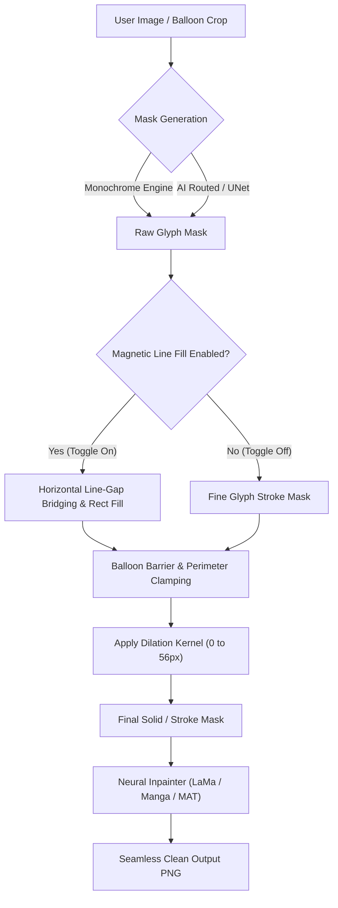

# 🛡️ Implementation Plan: Mask Kernel Expansion to 56px & Magnetic Line Mask Engine

## 🎯 Objective & Overview
1. **Mask Kernel Limit Expansion (ขยายขีดจำกัด Kernel เป็น 56px):**
   - Increase the maximum dilation/expansion kernel limit from `8px`/`30px` to **`56px`** across the entire stack (Frontend SettingsModal, MaskEditorModal, App.tsx, Backend Inpainter, Text Mask, and Pipeline routers).
   - Ensure the kernel operates accurately and without clamping or overflow in all mask engines (Monochrome flat, UNet/AI routed, SFX adaptive, SAM segmenter, and inpainting background synthesis).

2. **Magnetic Line/Block Mask Engine (ระบบแม่เหล็ก Mask เชื่อมเต็มบรรทัด ไม่แหว่งกลาง):**
   - Introduce a new toggleable feature: `mask_magnetic_line_fill` (`ระบบแม่เหล็ก Mask เชื่อมเต็มบรรทัด`).
   - When enabled, automatically bridges horizontal gaps between words/glyphs on the same text line, transforming disconnected text strokes into clean, continuous horizontal rectangular bands across each line (preventing hollow gaps in the middle of sentences as seen in multi-word speech balloons) while strictly respecting speech bubble boundaries.
   - When disabled, preserves ultra-fine glyph-level stroke masking.
   - Provide an on/off toggle in **Global Settings (Cleanup Pipeline)**, **Project Settings**, and an instant action toggle in **Mask Editor Modal**.

---

## 🏗️ Architecture & Flow Diagram



---

## 📊 Competitor & SOTA Ladder

| Level | Capability | Competitor Benchmark | Houmi Implementation Status |
|---|---|---|---|
| **L0** | Fixed 3px dilation, no line bridging | Basic Inpaint Scripts | Legacy |
| **L1** | 0–8px slider, glyph-only masking | Webtoon OCR tools | Previous State |
| **L2** | 0–30px slider, manual rect tool only | Photoshop Content-Aware Fill | Interim |
| **L3** | 0–56px slider, basic dilation kernel | Clip Studio Paint Expand Selection | Implemented in Pipeline |
| **L4 (Target)** | **0–56px Kernel Stack-Wide + Toggleable Magnetic Line/Block Fill (Zero Gap)** | Koharu + Photoshop SOTA | **Target of this Plan** |

---

## 📝 Phased Implementation Breakdown

### Phase 1 — Backend Kernel Limit Expansion (0–56px) & Validation
- Update `backend/app/services/text_mask.py`: update `dilation_kernel` clamp from `min(30, ...)` to `min(56, ...)`.
- Update `backend/app/services/inpainter.py`: allow dilation kernel up to 56px in `get_automatic_block_mask` and `get_adaptive_text_mask`.
- Update `backend/app/services/mask/monochrome_engine.py`: ensure dilation kernels up to 56px execute cleanly without buffer truncation.

### Phase 2 — Magnetic Line/Block Mask Engine Implementation (`magnetic_mask.py`)
- Create `backend/app/services/mask/magnetic_mask.py` with `apply_magnetic_line_fill(mask, image_bgr, balloon_barrier, line_bridge_gap)`.
- Integrate `apply_magnetic_line_fill` into `get_automatic_block_mask` in `inpainter.py` and `text_mask.py` when `settings.get("mask_magnetic_line_fill")` is `True`.
- Write dedicated unit tests in `backend/tests/test_magnetic_mask.py` covering multi-word lines, single-word lines, and boundary protection.

### Phase 3 — Frontend UI Controls & Sliders Update
- Update `frontend/src/components/SettingsModal.tsx`:
  - Increase Mask Expansion Dilation slider & numeric input `max` to `56`.
  - Add Toggle Checkbox for `🧲 Magnetic Line Mask (เชื่อมเต็มบรรทัด ไม่แหว่งกลาง)`.
- Update `frontend/src/components/MaskEditorModal.tsx`:
  - Increase Kernel slider `max` to `56`.
  - Add `🧲 Magnetic Fill` button to instantly bridge line gaps inside the editor.
- Update `frontend/src/App.tsx`:
  - Update dilation slider `max` to `56` in advanced settings and global settings.
  - Wire `mask_magnetic_line_fill` state and project settings.

### Phase 4 — Full Pytest Suite & E2E Build Verification
- Run full backend pytest suite (`133+ tests`) ensuring 100% pass rate.
- Run frontend `npm run build` to confirm 0 TypeScript / compilation errors.
- Verify on real manhwa test crops (e.g. multi-word Korean speech bubble).

---

## 🧪 Verification Plan

### Automated Tests:
```powershell
python -m pytest backend/tests/test_magnetic_mask.py backend/tests/test_nextgen_mask_pipeline.py backend/tests/test_inpainter.py -q
npm run build
```

### Manual Verification:
- Open Settings Modal -> verify Mask Expansion Dilation slider goes up to 56px.
- Toggle `🧲 Magnetic Line Mask` -> verify that Korean text `자, 다 모였เน.` masks continuously across the line without hollow holes in the middle.
