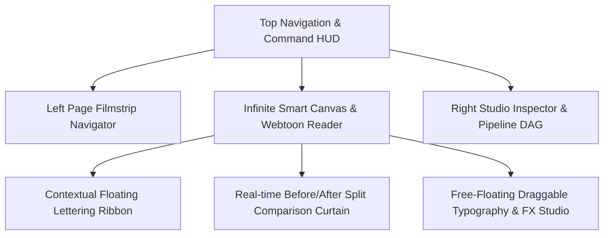

# 🚀 Plan: Next-Gen 100% Redesigned Houmi Studio UI/UX Preview Simulator

**Status:** Plan Approved / Execution Phase  
**Isolation Level:** 100% Isolated (Zero Changes to Main `frontend/src` and `backend/app` Code)  
**Output Target:** `e:/houmi/houmi-next-gen-preview.html`

---

## 🎯 Vision & Architectural Direction

Elevate Houmi Manga & Webtoon Studio into a world-class, ultra-modern creative workbench that rivals Figma, Adobe Photoshop Web, and DaVinci Resolve in speed, ergonomics, and aesthetic beauty.

---

## 🛠️ Phased Execution Plan

### Phase 1 — Interactive Next-Gen Workbench Prototype
- **File:** `e:/houmi/houmi-next-gen-preview.html`
- **Features:**
  1. **Top Command HUD & Spotlight Palette (Cmd+K / Ctrl+K)**: Instant search, model switcher, and action launcher.
  2. **Smart Canvas with Before/After Split Slider**: Drag a divider handle across the manga canvas to seamlessly compare raw Japanese/Chinese comic vs cleaned & Thai-typeset comic.
  3. **Contextual Floating Lettering Ribbon**: Modern pill with font stepper, palette, stroke, align, CJK vertical toggle, `🎯 Center in Balloon`, and `✨ Auto-Style`.
  4. **Free-Floating Draggable FX & Typography Widget**: Glassmorphism panel with smooth dragging, dock snaps, and collapsible sections.
  5. **Interactive Pipeline DAG Matrix**: Live visual nodes (Detect ➔ OCR ➔ Translate ➔ Inpaint ➔ Typeset) with animated progress pulses and step controls.
  6. **Interactive Translation QA Table**: Side-by-side glossary matching, spellcheck, and inline text editing.

### Phase 2 — Comprehensive Design System & Architecture Spec
- **File:** `e:/houmi/design-system/NEXT_GEN_STUDIO_SPEC.md`
- Complete token definitions, component hierarchy, state machines, and migration roadmap when ready for main codebase integration.

### Phase 3 — Verification & Visual Proof
- Run end-to-end verification, browser responsiveness checks, and capture complete walkthrough artifact.

---
