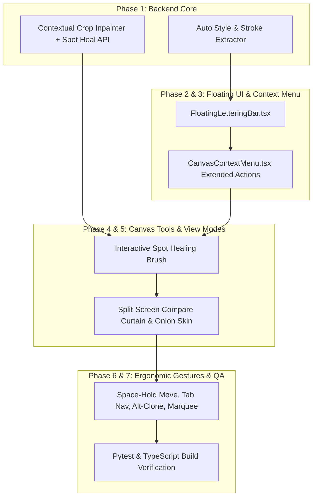

# Implementation Plan — Pro-Level Canvas, Lettering, Inpainting & Gesture Suite

This plan details the implementation of pro-level scanlation workflows, precision canvas gestures, contextual inpainting, style extraction, and floating lettering controls in Houmi Studio.

---

### Phase 1 — Backend Auto Style Extractor & Contextual Patch Inpainting
- **Goal**: Provide automated pixel-level style extraction (text color, background color, stroke color, stroke width) and high-speed contextual sub-region patch inpainting with a dedicated `/api/inpaint/spot-heal` endpoint.
- **Files**:
  - `backend/app/services/smart_balloon.py` (Add `extract_balloon_text_style` helper using Otsu binarization, K-Means clustering, and morphological gradient distance transform).
  - `backend/app/services/inpainter.py` (Add `inpaint_subregion_patch` with 48px padding and Gaussian/Poisson soft alpha feathering).
  - `backend/app/routes/inpaint.py` (Add `/api/inpaint/spot-heal` endpoint for real-time canvas brush strokes).
- **Verification**: Unit tests in `backend/tests/test_style_and_spot_heal.py`.

---

### Phase 2 — Floating Quick-Lettering Toolbar
- **Goal**: Create a lightweight, high-productivity floating toolbar that appears directly above the active TextBlock on the canvas.
- **Files**:
  - `frontend/src/components/FloatingLetteringBar.tsx` [NEW]
  - `frontend/src/components/Canvas.tsx` (Wire floating bar above selected block).
- **Features**:
  - Font family dropdown & quick size stepper (`±1pt` / scrubby drag).
  - Text fill color swatch + live canvas eyedropper tool.
  - Stroke color swatch & stroke width slider ($0 - 15\text{ px}$).
  - Text alignment buttons (Left, Center, Right, Diamond).
  - Direction toggle (Horizontal ↔ Vertical CJK).
  - Quick clone & delete buttons.
- **Verification**: Visual rendering and block state mutation test.

---

### Phase 3 — Extended Context Menu & Multi-Block Operations
- **Goal**: Enhance right-click context menu with split, copy/paste style, delete with inpaint, and multi-selection batch controls.
- **Files**:
  - `frontend/src/components/CanvasContextMenu.tsx`
  - `frontend/src/stores/projectStore.ts` (Add `splitBlock`, `copyBlockStyle`, `pasteBlockStyle`).
- **Features**:
  - Single block right-click: Split Horizontally (top/bottom lines), Split Vertically (left/right lines), Copy Text Style, Paste Text Style, Delete & Inpaint Background.
  - Multi-selection right-click: Merge Blocks (`Ctrl+M`), Equalize Width/Height, Batch Apply Preset, Batch Inpaint.
- **Verification**: Context menu click triggers and state updates.

---

### Phase 4 — Interactive Spot Healing Brush Tool on Canvas
- **Goal**: Implement in-canvas spot healing brush that allows users to paint over residual SFX/artifacts and triggers instant sub-region inpainting on pointer up.
- **Files**:
  - `frontend/src/components/Canvas.tsx`
  - `frontend/src/components/MaskToolbar.tsx`
- **Features**:
  - Spot Heal brush tool button (`B` or `P` key).
  - Dynamic brush circle cursor with size adjustable via `[` (smaller) and `]` (larger).
  - On pointer-up: sends stroke path/mask to `/api/inpaint/spot-heal`, receives patched image, and updates canvas seamlessly.
- **Verification**: Paint gesture and image refresh.

---

### Phase 5 — Split-Screen Compare Curtain & Onion Skin Opacity
- **Goal**: Provide professional before/after visual inspection tools on the canvas.
- **Files**:
  - `frontend/src/components/Canvas.tsx`
- **Features**:
  - Vertical split-screen compare curtain slider (drag handle to reveal original vs cleaned/translated side-by-side).
  - Onion Skin opacity slider ($0\% - 100\%$) for overlaid alignment checks.
  - Toggle bounding box outlines shortcut (`H` key).
- **Verification**: Slider drag interactions and visual layer clipping.

---

### Phase 6 — Ergonomic Gestures, Shortcuts & Block Navigation
- **Goal**: Polish all mouse gestures and keyboard shortcuts to match industry-standard scanlation lettering workflows.
- **Files**:
  - `frontend/src/components/Canvas.tsx`
- **Features**:
  - `Tab` / `Shift+Tab`: Cycle through blocks in topological reading order.
  - `Spacebar` (hold while dragging): Reposition new box before releasing pointer.
  - `Alt + Drag`: Clone/duplicate block.
  - `Shift + Drag` marquee: Add to selection; `Alt + Drag` marquee: Subtract from selection.
  - Arrow keys: Nudge 1px (`Shift + Arrows`: Nudge 10px).
- **Verification**: Keyboard and mouse gesture integration testing.

---

### Phase 7 — Full Verification & Quality Assurance
- **Goal**: Run complete test suite and TypeScript validation to guarantee zero regressions.
- **Verification**:
  - Run `pytest` on backend.
  - Run `npm run build` on frontend.
  - Validate all features on disk.
