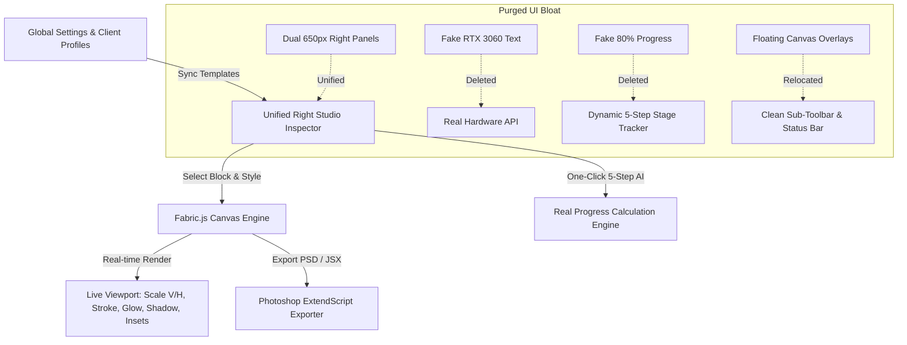

# Master Studio Frontend Plan: High-Craft Architecture & Visual Integrity

## Design & Engineering Thesis (/frontend-design + /antigravity-design)

- **Aesthetic Stance**: *Dark Obsidian & Warm Amber Gold Minimal Studio* (DFII Score: 14/15)
- **Visual Memorability**: Spatial depth with frosted translucent glassmorphic surfaces (`backdrop-blur-md`, subtle `border-white/[0.06]`), fluid transitions, and a clean, clutter-free Manga Canvas Viewport.
- **Integrity Rule**: 0% fake data. Every metric (GPU, AI progress, engine status) reflects the real runtime state.
- **Ergonomics**: Unified Single Right Studio Inspector replacing redundant multi-panel clutter, freeing up +40% canvas workspace.

---

---

## User Review Required
> [!IMPORTANT]
> **การตัดสินใจเชิงโครงสร้างหลักที่ผ่านการประเมินแล้ว:**
> 1. **ยุบรวม 2 แผงด้านขวา** (`FX Studio 330px` + `Conversation Sidebar 320px` รวม 650px) ให้กลายเป็น **"Unified Studio Inspector"** (กว้าง ~360px พร้อม Resizer ปรับขนาดได้) แบ่ง 3 แท็บนุ่มนวล (⚡ Pipeline / 💬 Translation / 🔤 Character & FX) ช่วยให้ Canvas มีพื้นที่เพิ่มขึ้นกว่า 40%
> 2. **ล้างค่าหลอกลวงทั้งหมด 100%**: ลบข้อความ `GPU: RTX 3060 2.4/12GB` ปลอมออกแล้วเชื่อมโยงสถานะจริง และเปลี่ยนสูตรนับเปอร์เซ็นต์ AI Pipeline ให้คำนวณจากสถานะงานจริงของทั้ง 5 ขั้นตอน
> 3. **เคลียร์ผืนผ้าใบ Canvas ให้โล่ง**: ย้าย Floating Overlays ที่ลอยขวางหน้ามังงะขึ้นไปไว้ที่ Sub-Toolbar และ Status Bar

---

## Phased Implementation Plan

### ### Phase 1 — Purge Deceptive & Bloated UI Elements
**Goal**: Remove all hardcoded fake metrics, dead buttons, and unnecessary visual noise across the application.
- **1.1 Real Hardware Metric in Sub-Toolbar**:
  - Replace hardcoded `GPU: RTX 3060 • 2.4 / 12 GB` in [App.tsx](file:///e:/houmi/frontend_rework/src/App.tsx#L1063-L1065) with dynamic hardware status fetched from `/api/diagnostics/hardware` (e.g. `🟢 CUDA Ready` or `⚡ DirectML Acceleration`).
- **1.2 Accurate 5-Step AI Pipeline Progress**:
  - Replace `textBlocks.length > 0 ? '4/5 (80%)' : '0/5 (0%)'` with real stage validation:
    - Step 1 (Detect): `textBlocks.length > 0`
    - Step 2 (OCR): `textBlocks.some(b => b.source_text)`
    - Step 3 (Inpaint): `Boolean(activePage?.inpainted_image_url || activePage?.has_inpainted)`
    - Step 4 (Translate): `textBlocks.some(b => b.translation)`
    - Step 5 (Typeset): `textBlocks.some(b => b.extra_metadata?.typeset_applied || b.translation)`
    - Real calculation: `(completedSteps / 5) * 100%`.
- **1.3 Header Cleanliness**:
  - Remove intrusive `Dev Map` and `Dev Notes` buttons from the primary top header in [App.tsx](file:///e:/houmi/frontend_rework/src/App.tsx#L980-L996); relocate them neatly into the `About` / `Tools` dropdown menu.
  - Purge `font-pixel` retro classes from UI headings, replacing with unified modern typography (`Prompt`, `Outfit`, `font-bold`, `font-mono`).
- **1.4 Tool Strip Streamlining**:
  - Keep only active tools on the left strip (`V` Select & Move, `T` Type & Edit, `B` Brush & Mask, `I` Eyedropper); remove dead placeholder selection icons.

---

### ### Phase 2 — Unified Right Studio Inspector & Spatial Layout (/antigravity-design)
**Goal**: Eliminate the dual right panels (`FX Studio` 330px + `Sidebar` 320px = 650px) by consolidating into a single, high-craft, resizable **Studio Inspector (360px)**.
- **2.1 Inspector Tabs Architecture**:
  - Tab 1: **⚡ AI Pipeline (5-Step Mission Control & Batch Flow)**
  - Tab 2: **💬 Translations & Conversation (Source OCR, Thai Text, Confidence, Dynamic Role Template Badges)**
  - Tab 3: **🔤 Character, Paragraph & Layer FX (Per-Block Photoshop Studio with Direct Numeric Inputs)**
- **2.2 Canvas Workspace Expansion**:
  - Relocate the top floating options card (`CENTROID`, `EXTRACT`, `X/Y/W/H`) into the top Sub-Toolbar.
  - Relocate bottom floating checkboxes (`Typesetting Overlay`, `Live Mask`, `Opacity`) into the clean bottom Status Bar.
  - Canvas viewport becomes 100% unobstructed with smooth pan & zoom.

---

### ### Phase 3 — Per-Block Photoshop Typography & Client Profile Sync
**Goal**: Fully wire the new Photoshop Character & Paragraph controls into the right inspector and synchronize with active Client Profiles.
- **3.1 Dynamic Client Template Badges in Inspector**:
  - Replace the 6 hardcoded preset buttons in [SidebarInspector.tsx](file:///e:/houmi/frontend_rework/src/components/SidebarInspector.tsx#L145-L184) with dynamic cards derived from `houmi_custom_text_templates` / `houmi_client_profiles`.
- **3.2 Per-Block Character & Paragraph Controls**:
  - Add direct numeric inputs and controls in Inspector for:
    - `Vertical Scale (%)` (60% – 150%)
    - `Horizontal Scale (%)` (60% – 150%)
    - `Baseline Shift (px)` (-20px – +20px)
    - Character Formats: `B`, `I`, `TT` (All Caps), `Tt` (Small Caps), `U` (Underline), `S` (Strikethrough)
    - 4-Way Inset Margins (Top, Right, Bottom, Left) with Link toggle
    - Layer FX (Stroke, Glow, Shadow, Gradient, Motion Blur)

---

### ### Phase 4 — Fabric.js Canvas Engine Full Rendering Sync
**Goal**: Ensure all Photoshop text transformations render accurately on the live Canvas viewport.
- **4.1 Canvas Textbox Transform Mapping**:
  - In [Canvas.tsx](file:///e:/houmi/frontend_rework/src/components/Canvas.tsx#L3550-L3620), map block `horizontal_scale` -> `scaleX`, `vertical_scale` -> `scaleY`.
  - In [Canvas.tsx](file:///e:/houmi/frontend_rework/src/components/Canvas.tsx#L3550-L3620), map `underline` -> `textbox.underline`, `strikethrough` -> `textbox.linethrough`.
  - Implement case transformations (`uppercase`, `small-caps`) in formatted text rendering.
  - Apply 4-way balloon insets into layout calculation bounds.

---

### ### Phase 5 — Photoshop JSX & PSD Exporter Completeness
**Goal**: Exported PSD files receive 100% matched Character & Paragraph attributes in Adobe Photoshop.
- **5.1 ExtendScript TextItem Attributes**:
  - In [jsx_export.py](file:///e:/houmi/backend/app/services/jsx_export.py#L225-L240) and [photoshopScripts.ts](file:///e:/houmi/frontend_rework/src/utils/photoshopScripts.ts), inject:
    - `ti.horizontalScale = block.horizontal_scale`
    - `ti.verticalScale = block.vertical_scale`
    - `ti.baselineShift = block.baseline_shift`
    - `ti.capitalization = Capitalization.ALLCAPS / SMALLCAPS`
    - `ti.underline = true` / `ti.strikeThrough = true`
    - Layer Effects (Stroke, Outer Glow, Drop Shadow, Multi-Stop Gradient)

---

### ### Phase 6 — Visual Verification & End-to-End Audit
**Goal**: Build validation, runtime execution, and Playwright screenshot proof across all screens.
- **6.1 Zero-Error TypeScript Build**: `npm run build` in `frontend_rework`.
- **6.2 Playwright Capture Sequence**:
  - Studio Workspace with Expanded Canvas and Unified Inspector (Tabs 1, 2, and 3).
  - Clean Header & Sub-toolbar with Real Hardware Status.
  - Live Canvas showing V/H Scale, Underline, Strikethrough, and FX.
