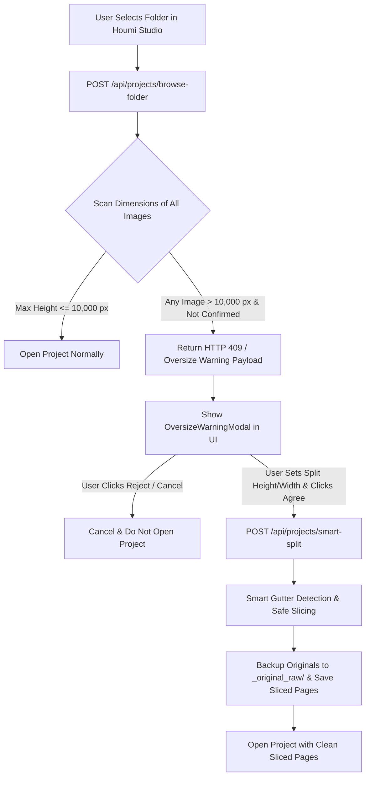

# Smart Stitch & Split Oversize Protection System — Implementation Plan

## Overview
Implement an intelligent safety measure and smart webtoon splitting/stitching system inspired by **SmartStitch** (`C:\Users\dansa\Desktop\SmartStitch`). When a user creates or opens a project folder containing long webtoon strips (height $> 10,000\text{ px}$ or configurable threshold), the system automatically detects oversize images, halts unsafe opening, prompts the user with an interactive modal to accept or reject smart slicing, and if accepted, performs high-precision gutter-aware image slicing without cutting through comic panels or speech bubbles.

---

## 1. Architecture & Core Workflow

---

## 2. Phased Implementation Plan

### Phase 1 — Smart Stitch & Gutter Detection Service (`backend/app/services/smart_stitch.py`)
- Implement `SmartStitchEngine` with:
  - `scan_folder_for_oversize(folder_path, threshold_height=10000)`: Lightweight header scan via PIL without loading full bitmaps into RAM.
  - `detect_safe_slice_points(image, target_height=5000, search_window=1500, sensitivity=90, scan_step=5, ignorable_border=5)`:
    - Scans horizontal row variance / edge gradient in the target window.
    - Finds empty background gutters (solid white, black, or uniform tone) to avoid cutting panels or dialogue text.
  - `smart_split_folder(folder_path, split_height=5000, enforce_width=None, backup_original=True)`:
    - Safely backs up original strips to `_original_raw/`.
    - Slices strips into balanced pages with high-quality resizing and sequential numbering (`01.png`, `02.png`, ...).

### Phase 2 — Backend API Integration (`backend/app/routes/projects.py` & `backend/app/routes/stitch.py`)
- Update `browse_folder_project`:
  - Before writing pages to DB, check for oversize images unless `confirm_oversize=True` or `split_config` is passed.
  - If oversize is found, return structured warning payload with scan stats and recommended dimensions.
- Add `POST /api/projects/smart-split` to execute slicing on demand and return the resulting clean project.

### Phase 3 — Frontend Warning & Configuration Modal (`frontend/src/components/OversizeWarningModal.tsx`)
- Create dedicated Oversize Warning Modal in React/TypeScript:
  - Clear Thai UI explaining the detection of oversized images.
  - Form controls for:
    - `Rough Split Height` (Default: 5000 px, options for 4000, 5000, 7500, 10000, or custom).
    - `Target Width` (Keep original or enforce 720 / 800 px).
    - `Backup Originals` checkbox.
  - Action buttons:
    - ❌ **ปฏิเสธ (ยกเลิก)**: Dismisses modal, clears status, and does not open the project.
    - ✂️ **ยินยอม & แบ่งภาพ (Smart Split & Open)**: Invokes smart split and opens the newly sliced project smoothly.

### Phase 4 — Unit & Regression Tests (`backend/tests/test_smart_stitch.py`)
- Write comprehensive tests for:
  - Header dimension scanning on various image types.
  - Safe gutter detection on comic strips with solid gutters vs. textured panels.
  - Split execution, folder backup, and project loading integration.

---

## 3. Verification Plan
1. **Automated Tests**:
   - `pytest backend/tests/test_smart_stitch.py -v`
   - Run full regression test suite: `pytest tests/ -v`
2. **End-to-End Verification**:
   - Test folder with a simulated 28,000 px webtoon image.
   - Verify rejection stops project creation.
   - Verify acceptance splits image at panel gutters into ~5,000 px pages and loads the project instantaneously.
