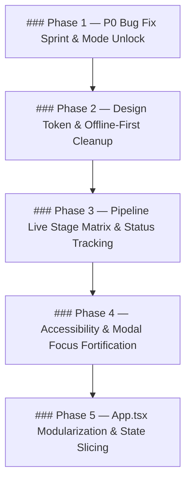

# 🛡️ GODKILLER PLAN: Houmi Studio UI/UX Refinement & Stability (Preserving Current Layout)

## 0. Executive Intent & Constraints
* **Scope**: พัฒนาและปรับปรุง UI/UX ของ Houmi Studio ตามผลการตรวจสอบและสรุปปัญหา โดย **ยึด Layout, Toolbar, Canvas, Sidebar และ Inspector ปัจจุบันเป็นหลัก ไม่ใช้ Mockup ขวามือตามภาพที่ผู้ใช้ปฏิเสธ**
* **Standard**: GODKILLER Protocol — One Phase / turn, Disk evidence over chat claims, Hard gates, No fake done.

---

### Phase 1 — P0 Bug Fix Sprint & Mode Unlock
* **Objective**: แก้ไขข้อผิดพลาดระดับ P0 และปลดล็อกฟังก์ชันที่เข้าไม่ถึงใน UI ปัจจุบัน
* **Evidence & Citations**:
  * `App.tsx:659` & `App.tsx:3794`: `workspaceMode` ถูกล็อกไว้ที่ `'ocr'` ทำให้ `workspaceMode === 'typeset'` ใน `App.tsx:4487, 4776, 4782` เป็น Dead Code
  * `App.tsx:1414` vs `App.tsx:2127`: ปุ่ม `?` สั่งเปิดทั้ง `HotkeyModal` และ `ShortcutsLegend` ซ้อนทับกันที่ `z-50`
  * `HotkeyModal.tsx:29-35`: โฆษณา `Shift+D/O/I/T` ที่ไม่มี handler ในโค้ด ขณะที่ `Canvas.tsx:1451-1476` มี `V`, `M`, `B`, `Shift+C`
  * `App.tsx:5689`: Hardcode `v0.1.4` ขัดกับ `version.ts:8` (`HOUMI_VERSION_LABEL = v1.0.1`)
  * `App.tsx:1388-1395`: Auto-collapse sidebar ปิดเมื่อ `< 1280px` แต่ไม่มีโค้ดเปิดคืนเมื่อจอขยาย
* **Tasks**:
  1. เพิ่มปุ่มสลับ `[ 📝 OCR Mode ]` / `[ 🎨 Typeset Mode ]` บน Sub-toolbar และเมนู Tools/View ใน `App.tsx` เพื่อให้เรียกใช้ Typeset Inspector ที่มีอยู่แล้วได้
  2. รวมระบบ Modal คีย์ลัดเข้าสู่ `HotkeyModal.tsx` เพียงตัวเดียว และลบ `showShortcutsLegend` ซ้ำซ้อน
  3. ปรับปรุงรายการคีย์ลัดใน `HotkeyModal.tsx` ให้ตรงกับระบบจริง (`V`, `M`, `B`, `A` / `Shift+C`, `Tab`, `Enter`, `Delete`, `Ctrl+F`, `Ctrl+Shift+S`)
  4. เปลี่ยนข้อความใน Status Bar (`App.tsx:5689`) ให้ใช้ `${HOUMI_VERSION_LABEL}` จาก `version.ts`
  5. ปรับปรุง `handleScreenResize` ให้คืนค่าการแสดงผล Sidebar เมื่อหน้าจอกว้างขึ้น
* **Gate / Verification**:
  * `npm run build` ผ่าน 100% ไร้ TypeScript error
  * กด `?` เปิด Modal เดียวเท่านั้น
  * สลับเป็น Typeset Mode แล้ว Typeset Inspector เดิมเปิดแสดงและปรับแต่งได้จริง

---

### Phase 2 — Design Token & Offline-First Cleanup
* **Objective**: จัดการระบบ CSS Tokens, ตัดการพึ่งพา CDN และขจัดความซ้ำซ้อน
* **Evidence & Citations**:
  * `index.css:1`: `@import url(fonts.googleapis.com...)` โหลดผ่านเน็ต ขัดกับ ADR-002 (Offline-first desktop) โหลด `Silkscreen` และ `VT323` ที่ไม่ได้ใช้งาน
  * `index.css:258, 287, 315`: ชื่อคลาส `.pixel-btn-purple` (สีเทา), `.pixel-btn-magenta` (สีเหลือง) ขัดกับสีจริง
  * `index.css:125` & `368`: `.input-glass` ประกาศซ้ำ 2 รอบพร้อม `!important`
* **Tasks**:
  1. สร้าง `tokens.css` หรือรวมตัวแปร CSS Tokens (`--bg`, `--panel`, `--line`, `--amber`, `--t-badge`, `--z-modal`) ลงใน `index.css`
  2. เปลี่ยน Font Import เป็น System Font Stack ที่รองรับภาษาไทย/อังกฤษแบบ Offline 100% (`"Segoe UI", "Leelawadee UI", "Noto Sans Thai", system-ui`)
  3. ลบ Class ซ้ำซ้อนและตั้งชื่อ Semantic ให้สอดคล้องกับหน้าที่การทำงาน
* **Gate / Verification**:
  * UI แสดงผลถูกต้องโดยไม่ต้องต่ออินเทอร์เน็ต
  * ไม่มี 404/Network failure บน Console จาก CDN Fonts

---

### Phase 3 — Pipeline Live Stage Matrix & Status Tracking
* **Objective**: เพิ่มการแสดงสถานะ 8 ขั้นตอนของ Pipeline (Detect → Sort → OCR → Mask → Inpaint → Font → Typeset → Render) บน Sub-toolbar และ Page List ปัจจุบัน โดยไม่เปลี่ยนโครงสร้าง Layout
* **Evidence & Citations**:
  * `App.tsx:2481`: `runPipelineStep()` รองรับ 8 สถานะ แต่ `App.tsx:4295-4299` แสดง Badge แค่ `processed` / `pending`
* **Tasks**:
  1. เพิ่มตัวแสดงสถานะ Stage Indicator บนแถบ Sub-toolbar ปัจจุบัน
  2. ปรับ Sidebar Page List ให้มีตัวบ่งชี้ขั้นตอนของแต่ละหน้า (Stage Dots / Progress Indicator)
* **Gate / Verification**:
  * เมื่อรันขั้นตอนใดขั้นตอนหนึ่ง สถานะของหน้านั้นจะอัปเดตแบบเรียลไทม์

---

### Phase 4 — Accessibility & Modal Focus Fortification
* **Objective**: ปรับปรุงการเข้าถึง (Accessibility) และ Focus Trap ของ Modal ทั้งหมดในระบบ
* **Evidence & Citations**:
  * มีเพียง 1 ใน 36 Modal components ที่มี `role="dialog"` และ `aria-labelledby`
* **Tasks**:
  1. เพิ่ม `role="dialog"`, `aria-modal="true"`, และ `aria-labelledby` ให้กับ Modal components หลัก
  2. รองรับปุ่ม `Escape` ในการปิด Modal ทุกตัวอย่างสม่ำเสมอ
* **Gate / Verification**:
  * ทุก Modal สามารถปิดได้ด้วยปุ่ม `Esc` และมี ARIA attributes ถูกต้อง

---

### Phase 5 — App.tsx Modularization & State Slicing
* **Objective**: แยก State และ Handlers ออกจาก `App.tsx` (9,110 บรรทัด, 195 `useState`) เป็น Zustand slices และ Custom hooks โดยคง UI และการทำงานเดิมไว้ 100%
* **Evidence & Citations**:
  * `App.tsx` มีขนาด 9,110 บรรทัด และ 195 useState กระจุกตัว
* **Tasks**:
  1. แยก Pipeline state ไปยัง `pipelineStore.ts`
  2. แยก Canvas & Tool state ไปยัง `canvasUiStore.ts`
  3. ลดขนาด `App.tsx` ให้เหลือเพียง Composition Component หลัก
* **Gate / Verification**:
  * Unit tests และ E2E diagnostics ผ่านครบทุกจุด
