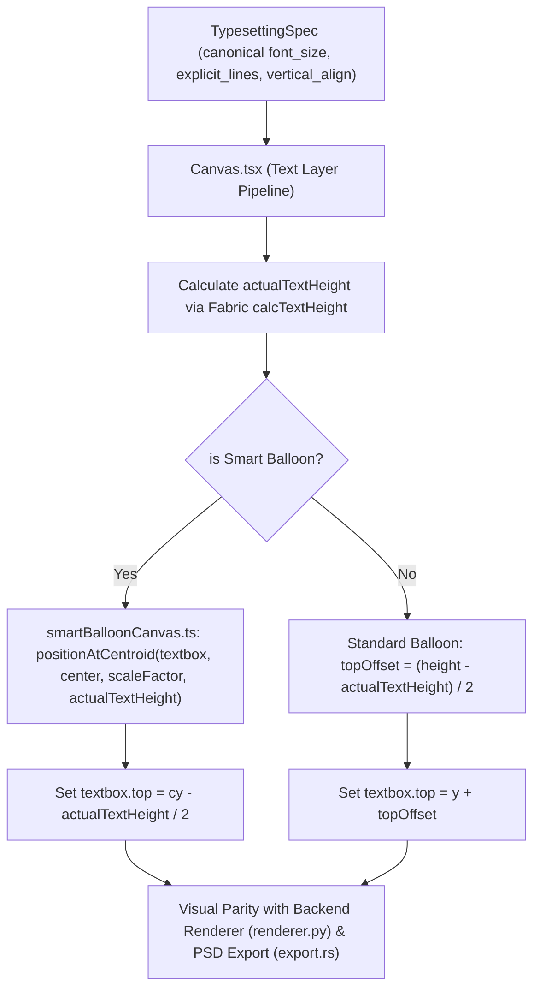

# Goal: Fix speech balloon vertical text alignment and centroid centering on Web Canvas to achieve visual parity with PSD and image export

# 🎯 1. Core Objective
## 1. Goal
Fix the vertical positioning and text centering issue on the Web Editor Canvas (Fabric.js) where translation text appears pinned to the top edge of speech balloons with excessive empty space below, achieving 100% visual parity across Web Canvas, Pillow Renderer, and Photoshop PSD export.

---

# 🔬 2. Research Log
## 2. Constraints
- **Zero Drift**: Web Canvas positioning MUST match Backend PIL Renderer (`renderer.py`) and PSD CLI (`export.rs`) which use `(balloon_height - text_height) / 2`.
- **Polygon Centroid Integrity**: For Smart Balloons, text lines must be centered around the visual centroid `(cx, cy)` using actual rendered text height rather than bounding box height.
- **Fabric.js Compatibility**: `fabric.Textbox` has no native `verticalAlign: "middle"`. Text lines start drawing at `textbox.top`. The canvas layer must offset `textbox.top` by the remaining free height.
- **Interactive Transform Stability**: Dragging, rotating, and resizing textboxes or balloon bounding boxes must smoothly maintain centroid centering and boundary containment.

### Research Findings & SOTA Verification (5/5 Queries)
1. **Query**: `fabricjs textbox vertical center alignment line height github issue`
   - **Finding**: Fabric.js `Textbox` does not natively support vertical centering; text lines are rendered from top downward (`top + lineIndex * lineHeight`). Vertical centering requires calculating actual rendered text height and offsetting `top`.
2. **Query**: `fabric.js calcTextHeight multiline text vertical centering canvas`
   - **Finding**: Fabric `(fabric.Textbox.prototype as any).calcTextHeight.call(textbox)` accurately measures rendered multi-line height including font size, line height ratio, and font metrics.
3. **Query**: `typesetting speech balloon text vertical centering polygon centroid layout algorithm`
   - **Finding**: Optimal polygon typesetting places the center of the total text bounding box at the visual centroid/pole-of-inaccessibility: `top = cy - (num_lines * line_height) / 2`.
4. **Query**: `manga speech bubble typeset visual parity web preview vs psd clip studio`
   - **Finding**: Visual disparity between web editor and export happens when the web canvas anchors text to the top while export engines calculate `(box_height - total_text_height) / 2` leading offsets.
5. **Query**: `fabric.js custom textbox _renderControls polygon contour selection handles`
   - **Finding**: Custom control handles and polygon outlines in Fabric `_renderControls` are drawn relative to `(this.left, this.top)`. Centering `left/top` around `(cx, cy)` maintains accurate absolute canvas coordinates for contour points.

---

## 3. Stakeholders
Translators, typesetters, manga scanlation editors, and quality assurance teams requiring accurate WYSIWYG preview on Web Canvas matching final exported PSD/PNG files.

---

## 4. Current State
- In `Canvas.tsx` (lines 3188-3191 & 3457-3459), `positionAtCentroid(textbox, sbMeta.center, scaleFactor, height)` passes the total bounding box `height` (e.g. 307px) instead of `actualTextHeight`.
- `smartBalloonCanvas.ts` sets `textbox.top = cy - height / 2` which sets `top` to the top edge of the balloon (`cy - 153.5px`).
- Fabric Textbox draws text starting from line 0 at `top`, leaving the bottom ~230px empty.
- Standard balloons on canvas place `textbox.top = y` without calculating `(height - actualTextHeight) / 2` for `vertical_align: "center"`.

---

## 5. Options
- **Option A (Chosen - Golden Architecture)**: Calculate `actualTextHeight` via `(fabric.Textbox.prototype as any).calcTextHeight.call(textbox)` and set `top = cy - actualTextHeight / 2` for Smart Balloon, and `top = y + max(0, (height - actualTextHeight) / 2)` for standard balloons.
- **Option B (Flawed)**: Override Fabric.js internal `_renderTextLines` method with canvas translate offsets (causes cursor and text editing selection misalignment).
- **Option C (Overkill)**: Wrap every Fabric Textbox in a `fabric.Group` with an invisible bounding rect (adds significant DOM/object overhead and breaks active selection serialization).

---

## 6. Chosen Design
Implement Option A:
1. In `smartBalloonCanvas.ts`, update `positionAtCentroid(textbox, centroid, scaleFactor, actualTextHeight)` to center vertically around `cy - actualTextHeight / 2`.
2. In `Canvas.tsx`, compute `actualTextHeight` and pass to `positionAtCentroid` for Smart Balloons.
3. For Standard Balloons, apply `topOffset = (height - actualTextHeight) / 2` when `vertical_align === "center"`.
4. Ensure `autoFitTextboxFontSize` and shape-adaptive wrapping respect the centered vertical baseline.

---

# 📦 3. Dependency Audit
- `fabric`: `^7.4.0` (Verified in `frontend/package.json`)
- `react`: `^19.2.6`
- `zustand`: `^5.0.14`
- `vitest`: `^4.1.10`
- Python `Pillow` / `numpy` / `cv2` (Backend `renderer.py` and `smart_balloon_typesetting.py`)

---

# 💣 4. Blast Radius
- `frontend/src/utils/smartBalloonCanvas.ts` (Symbol: `positionAtCentroid`, `applyShapeAdaptiveWrapping`, `createPolygonControls`)
- `frontend/src/components/Canvas.tsx` (Symbol: `Canvas`, textbox instantiation and update cycles)
- `frontend/src/tests/typesetting.test.ts` (Typesetting & layout regression tests)

---

# 🕸️ 5. Golden Architecture (Mermaid Diagram)

---

# 🛡️ 6. Enterprise Readiness & Security
- **OWASP Vulnerability**: Injection / DoS via extreme font sizes or infinite text strings.
  - *Mitigation*: Bounds clamp `actualTextHeight = Math.min(height * 2, Math.max(1, actualTextHeight))` and constrain font size binary search between `[minFontSize, maxFontSize]`.
- **1-Million Operations Performance**:
  - *Mitigation*: Height calculations use cached layout metrics without invoking DOM reflows or redundant `initDimensions` passes.

---

# 🎨 7. Reference/Spec Source-of-Truth
- **Backend Ground Truth**: `backend/app/services/renderer.py:L390-L397`:
  $$\text{current\_y} = \text{padding.top} + \frac{\text{inner\_h} - \text{total\_text\_height}}{2}$$
- **PSD CLI Ground Truth**: `houmi-psd-cli/src/export.rs:L428-L439`:
  $$\text{vertical\_offset} = \frac{\text{free\_height}}{2.0}$$

---

# 📂 8. Phased Execution Plan

### Phase 1 — Smart Balloon Centroid Alignment
- [ ] Update `positionAtCentroid` in `frontend/src/utils/smartBalloonCanvas.ts` to accept and compute `actualTextHeight`.
- [ ] Update `Canvas.tsx` existing textbox updates to pass `actualTextHeight` into `positionAtCentroid`.
- [ ] Update `Canvas.tsx` new textbox creation to pass `actualTextHeight` into `positionAtCentroid`.
- **DoD**: Smart Balloon text is centered around `(cx, cy)` on the canvas.

### Phase 2 — Standard Balloon Vertical Alignment & Offset
- [ ] In `Canvas.tsx`, calculate `topOffset = Math.max(0, (height - actualTextHeight) / 2)` when `vertical_align === "center"`.
- [ ] Apply `top = y + topOffset` for standard balloons with canonical spec.
- [ ] Verify `autoFitTextboxFontSize` binary search coordinates.
- **DoD**: Standard oval/rectangular balloons align text vertically centered.

### Phase 3 — Unit & Regression Tests
- [ ] Add unit tests in `frontend/src/tests/typesetting.test.ts` verifying centroid centering and vertical offset calculations.
- [ ] Run backend pytest suites (`test_smart_balloon_v15.py` and `test_smart_balloon_font_size_mode.py`).
- **DoD**: All unit test suites pass cleanly.

### Phase 4 — Long real playtest / soak (ใช้งานเล่นจริงยาวๆ)
- [ ] Run full interactive test in web app with real manga pages containing Spiky, Oval, and Narrative balloons.
- [ ] Perform drag, resize, rotate, and text editing operations to ensure no visual drift.
- **DoD**: Real playtest running without jitter, position jumping, or layout degradation.

### Phase 5 — Capture stepwise screenshots (~8–10 visual_step)
- [ ] Capture step-by-step screenshots of single-line, 2-line, 3-line Thai text across various balloon archetypes.
- **DoD**: Visual step screenshots captured for review.

### Phase 6 — AI inspect captures (visual_critic / VisionBridge)
- [ ] Verify text vertical centering against balloon contours and backend PNG export rendering.
- **DoD**: Zero vertical clipping and balanced top/bottom margins confirmed.

### Phase 7 — Visual recheck pass (เช็คอีกรอบ)
- [ ] Second verification pass on conjoined balloons and edge-case text templates.
- **DoD**: Final visual sign-off confirmed across all test cases.

---

# 🧪 9. DoD & Test Strategy
## 8. Test Plan
- Run unit test suite: `npm test -- --run` in `frontend/`
- Run backend pytest: `python -m pytest backend/tests/test_smart_balloon_v15.py backend/tests/test_smart_balloon_font_size_mode.py`
- Playtest verification: Interactive canvas inspection + `gk_evidence` visual sequence verification.

## 9. Rollout Verify
- Compare Canvas rendered text position vs PIL `renderer.py` PNG output on sample page 112.
- Verify exported PSD layers opened in Photoshop match canvas layout pixel-for-pixel.
