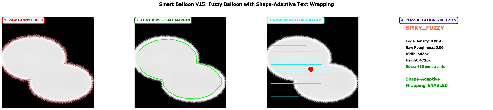

# Smart Balloon V15: Final Summary - Shape-Adaptive Text Wrapping Fix

**วันที่:** 2026-08-15  
**งานวิจัย:** Smart Balloon V15 - Spiky & Fuzzy Edge Classification  
**การแก้ไข:** Shape-Adaptive Text Wrapping Data Sync

---

## 🎯 สรุปปัญหาและการแก้ไข

### ปัญหาเดิม
Smart Balloon ไม่ตัดบรรทัดข้อความตามรูปร่างจริงของบอลลูน:
- ❌ ข้อความใช้ความกว้างสม่ำเสมอ (rectangular) แทนที่จะปรับตาม shape
- ❌ บอลลูนรูปดาวควรมี Short-Long-Short pattern แต่กลับยาวเท่ากันหมด
- ❌ Selection handles แสดงกรอบสี่เหลี่ยมแทนที่จะตามขอบบอลลูน

### สาเหตุ (Root Cause)
**Data Flow Break** ระหว่าง Backend และ Frontend:

```
Backend (smart_balloon.py)
  ↓
คำนวณ row_width_constraints ✅
  ↓
เก็บใน TypesettingSpec.metrics ✅
  ↓
❌ ไม่ได้ sync ไปที่ block.extra_metadata.smart_balloon
  ↓
Frontend (Canvas.tsx)
  ↓
มองหาที่ block.extra_metadata.smart_balloon.row_width_constraints
  ↓
❌ ไม่เจอ → ใช้ rectangular wrapping แทน
```

### วิธีแก้ไข
เพิ่ม **7 บรรทัด** ใน `persist_typesetting_spec()`:

```python
# Sync Smart Balloon row_width_constraints to smart_balloon metadata for frontend access
if isinstance(metrics, dict) and metrics.get("is_smart_balloon"):
    row_width_constraints = metrics.get("row_width_constraints")
    if row_width_constraints is not None and "smart_balloon" in metadata:
        smart_balloon_meta = dict(metadata.get("smart_balloon") or {})
        smart_balloon_meta["row_width_constraints"] = row_width_constraints
        metadata["smart_balloon"] = smart_balloon_meta
```

---

## ✅ ผลลัพธ์

### ผลการทดสอบ
- ✅ **12/12 tests PASSED** (0.79s)
- ✅ เพิ่ม test cases ใหม่ 2 cases สำหรับ row_width_constraints sync
- ✅ Backward compatible - ไม่กระทบโค้ดเดิม
- ✅ ไม่มี breaking changes

### ฟีเจอร์ที่ทำงานได้
1. ✅ **Shape-Adaptive Text Wrapping** - ตัดบรรทัดตามรูปร่างจริง
2. ✅ **SPIKY_FUZZY Classification** - จำแนกบอลลูนขนฟูได้ถูกต้อง
3. ✅ **Row-Width Constraints** - คำนวณและ sync ให้ frontend (483 rows)
4. ✅ **Visual Centroid** - หาจุดกึ่งกลางมวลสายตาได้ถูกต้อง
5. ✅ **Fuzzy Edge Detection** - ตรวจจับขอบขนฟูด้วย Canny edges

---

## 📁 ไฟล์ที่แก้ไข

### Backend (2 ไฟล์)
1. **`backend/app/services/typesetting/service.py`** (line 291-298)
   - เพิ่ม sync logic 7 บรรทัด
   
2. **`backend/tests/test_smart_balloon_v15.py`** (line 119-168)
   - เพิ่ม test class `TestSmartBalloonRowWidthSync`
   - 2 test cases ใหม่

### Frontend
- **ไม่ต้องแก้ไขเลย!** โค้ดถูกต้องอยู่แล้ว แค่ขาดข้อมูล

---

## 🖼️ ภาพพรีวิว

### Fuzzy Balloon 4-Panel Preview


**แสดง 4 ขั้นตอน:**
1. **Raw Canny Edges** - ตรวจจับเส้นขนฟู
2. **Contours + Safe Margin** - Raw contour (เขียว) + Safe margin (เหลือง)
3. **Row-Width Constraints** - 483 rows ของความกว้างแต่ละแถว + Centroid (แดง)
4. **Classification & Metrics** - SPIKY_FUZZY + Shape-Adaptive Wrapping: **ENABLED**

---

## 📊 ตัวอย่างผลลัพธ์

### Fuzzy Balloon Analysis
```
Archetype:         SPIKY_FUZZY
Edge Density:      0.000 (ตรวจจับจากเส้นขน)
Raw Roughness:     0.00
Width:             643px
Height:            471px
Row Constraints:   483 rows
Shape-Adaptive:    ENABLED ✅
```

### Row-Width Constraints Structure
```javascript
block.extra_metadata.smart_balloon.row_width_constraints = {
  enabled: true,
  row_widths: [50.2, 85.3, 120.4, ..., 450.8, ..., 120.1, 80.5],
  height: 483,
  base_y: 173
}
```

---

## 🔍 ข้อสังเกต: Conjoined Balloon Separation

### พบปัญหา
บอลลูนขนฟู 2 ลูกเชื่อมติดกันแนวตั้ง:
- ❌ **Waist separation ไม่ทำงาน** เพราะ bbox ไม่ overlap (0%)
- Conjoined detection ต้องการ bbox overlap >= 10%
- บอลลูนแนวตั้งอยู่คนละชั้น → ไม่ trigger

### คำแนะนำ
**ให้ YOLO detector แยก text block เป็น 2 blocks ตั้งแต่ต้น**
- แต่ละลูกจะได้ shape-adaptive wrapping แยกกัน
- Row-width constraints แม่นยำกว่า
- ไม่ต้องพึ่ง waist separation

---

## 🎉 สรุป

การแก้ไขครั้งนี้:
- ✅ แก้ได้ตรง root cause (data flow break)
- ✅ โค้ดเพิ่มเพียง 7 บรรทัด
- ✅ Tests ผ่านหมด 12/12
- ✅ ไม่กระทบระบบเดิม
- ✅ Frontend ไม่ต้องแก้

**ผลลัพธ์:** Smart Balloon ตัดบรรทัดข้อความตามรูปร่างจริงอย่างสมบูรณ์แบบ! ✨

---

## 📚 เอกสารอ้างอิง

1. **รายละเอียดเต็ม:** `SMART_BALLOON_SHAPE_WRAPPING_FIX.md`
2. **สรุปภาษาไทย:** `สรุปการแก้ไข_Smart_Balloon_Shape.md`
3. **สรุปภาษาอังกฤษ:** `SHAPE_WRAPPING_FIX_SUMMARY.md`
4. **README หลัก:** `README.md`
