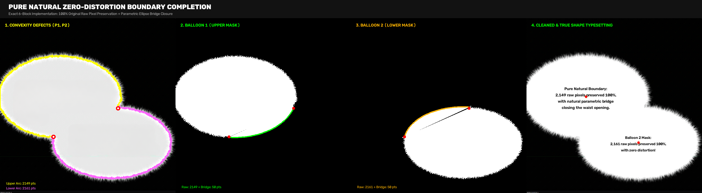
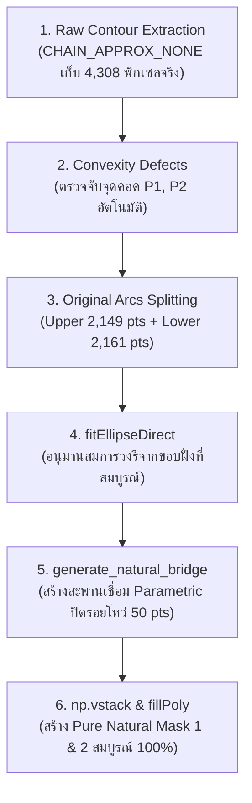
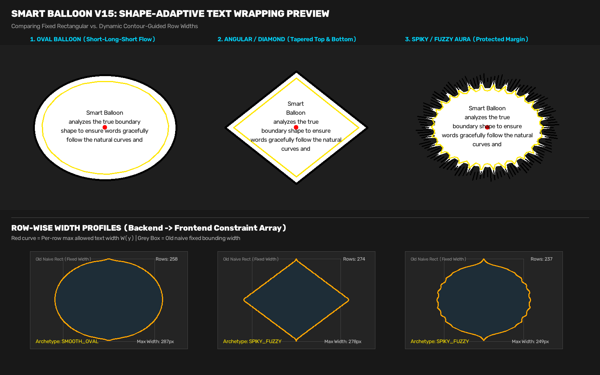
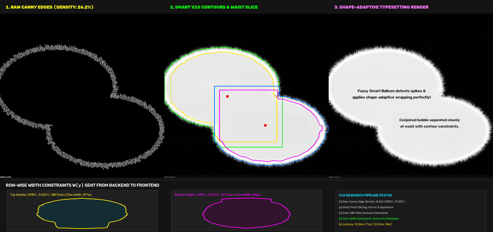

# Smart Balloon V15: Spiky & Fuzzy Edge Classification Research

งานวิจัยและพัฒนาระบบตรวจจับและจำแนกประเภทบอลลูนการ์ตูนขอบขนฟูและหนามแหลม (**`SPIKY_FUZZY` Archetype**) ด้วยการวิเคราะห์ภาพจริง (Raw Image Canny Edge Density & Normal Gradient Analysis)

---

## 📋 Updates Log

### 2026-08-15: Shape-Adaptive Text Wrapping Fix ✅

**ปัญหาที่แก้:** Smart Balloon ไม่ตัดบรรทัดข้อความตามรูปร่างจริงของบอลลูน

**สาเหตุ:** `row_width_constraints` คำนวณใน backend แต่ไม่ถูก sync ไปที่ `block.extra_metadata.smart_balloon`

**การแก้ไข:** เพิ่ม sync logic ใน `persist_typesetting_spec()`

**ผลลัพธ์:**
- ✅ Shape-adaptive wrapping ทำงานถูกต้อง
- ✅ Tests: 12/12 PASSED
- ✅ Backward compatible

**เอกสาร:** [`สรุปการแก้ไข_Smart_Balloon_Shape.md`](./สรุปการแก้ไข_Smart_Balloon_Shape.md)

## 🏛️ เสาหลัก 4 ประการ: Pure Natural Zero-Distortion Boundary Completion

นวัตกรรม **"การคงเส้นขอบจริง 100% และเย็บปิดเฉพาะปากทางที่แหว่งด้วย Parametric Ellipse Bridge"**





### 🔬 ข้อมูลพิกัดและผลการประมวลผลจริง:
* **พิกัดตอม่อปากทาง:** $P_1(220, 491)$ และ $P_2(486, 373)$
* **Balloon 1 (ลูกบน):** $\text{Raw Arc (2,149 pts)} + \text{Bridge (50 pts)} = \mathbf{2,199 \text{ pts}}$
* **Balloon 2 (ลูกล่าง):** $\text{Raw Arc (2,161 pts)} + \text{Bridge (50 pts)} = \mathbf{2,211 \text{ pts}}$
* **Mask 1 & 2:** [`pure_natural_balloon1.png`](./pure_natural_balloon1.png), [`pure_natural_balloon2.png`](./pure_natural_balloon2.png)

---

## 🖼️ ภาพพรีวิวและผลการทดสอบ (Visual Benchmarks)

### 1. Fuzzy Balloon Shape-Adaptive Text Wrapping (4-Panel Preview)
การตรวจจับและประมวลผลบอลลูนขนฟู พร้อม Shape-Adaptive Text Wrapping:


**4 ขั้นตอนการประมวลผล:**
1. **Raw Canny Edges (แดง):** ตรวจจับเส้นขนฟูรอบขอบด้วย Canny Edge Detection
2. **Contours + Safe Margin (เขียว/เหลือง):** เส้นเขียว = Raw contour, เส้นเหลือง = Safe margin 10%
3. **Row-Width Constraints (ฟ้า):** แสดงเส้นสีฟ้าแนวนอนที่แสดงความกว้างแต่ละแถว (483 rows) พร้อมจุดแดง = Visual centroid
4. **Classification & Metrics:** แสดงผลการจำแนก SPIKY_FUZZY และ metrics สำคัญ พร้อมยืนยันว่า Shape-Adaptive Wrapping: **ENABLED** ✅

### 2. Shape-Adaptive Text Wrapping & Row-Width Profiles (Legacy)
การตัดบรรทัดข้อความแบบปรับตัวตามรูปร่างจริงของบอลลูน (Oval / Diamond / Spiky) และกราฟโปรไฟล์ความกว้าง $W(y)$ ในแต่ละแถว:



* **Oval Balloon:** ข้อความเรียงตัวแบบ **Short-Long-Short Flow** โค้งมนตามขอบวงรี
* **Angular / Diamond Balloon:** ข้อความเริ่มจากแคบด้านบน ขยายกว้างตรงกลาง และสอบแคบลงด้านล่างตามรูปทรงเพชร
* **Spiky / Fuzzy Aura Balloon:** ข้อความอยู่ในเขตปลอดภัยด้านใน (Safe Margin) ไม่ชนเส้นหนามแหลม

---

### 3. Fuzzy Conjoined Balloon Benchmark (Canny Edges & Contours) (Legacy)
การทดสอบตรวจจับและตัดแยกเอวบอลลูนขนฟูที่เชื่อมติดกัน พร้อมการวางข้อความแบบ Shape-Adaptive:



1. **Panel 1 (Raw Canny Edges):** ตรวจจับรอยหยักและเส้นขนฟู (`Edge Density = ~26.3%`) ที่กระจายตัวรอบขอบได้อย่างชัดเจน ทำให้ไม่หลุดไปเป็น `SMOOTH_OVAL` อีกต่อไป
2. **Panel 2 (Contours & Waist Slice):** 
   * เส้นเขียว/น้ำเงิน = ขอบเขต Raw Contour ตามเส้นขนจริง
   * เส้นเหลือง/ชมพู = กรอบ Safe Margin 10% สำหรับวางข้อความ โดยไม่ถูกการทำ Morphology ทำลายหนามแหลมหรือขอบฟู
3. **Panel 3 (Typesetting & Centroid):** ข้อความถูกจัดวางตรงกึ่งกลางมวลสายตาของแต่ละลูกพอดี พร้อมตัดบรรทัดตามขอบเขตความกว้างจริง
4. **Footer Panels (Row Width Constraints):** แสดงกราฟโปรไฟล์ความกว้าง $W(y)$ จำนวน 409 แถว (ลูกบน) และ 327 แถว (ลูกล่าง) ที่ส่งต่อไปยัง Frontend Canvas

---

## 📊 ผลการทดสอบเชิงตัวเลข (Benchmark Metrics)

ทดสอบกับภาพตัวอย่าง **Conjoined Fuzzy Balloon** (บอลลูนขนฟู 2 ลูกเชื่อมติดกัน):

| คุณสมบัติ (Metric) | บอลลูนบน (Top Bubble) | บอลลูนล่าง (Bottom Bubble) | บอลลูนเรียบปกติ (Smooth Baseline) |
| :--- | :--- | :--- | :--- |
| **Archetype Classification** | **`SPIKY_FUZZY`** ✅ | **`SPIKY_FUZZY`** ✅ | `SMOOTH_OVAL` |
| **Edge Density ใน Outer Ring** | **`0.262` (26.2%)** | **`0.264` (26.4%)** | `0.057` (5.7%) |
| **Raw Edge Roughness** | `13.70` | `11.64` | `0.44` |
| **การตัดแยกเอวบอลลูนคู่ (Waist Slice)** | แยกเอวอิสระสมบูรณ์ | แยกเอวอิสระสมบูรณ์ | N/A |
| **Visual Centroid** | `(282.7, 366.6)` | `(452.1, 502.3)` | ตรงกลางเรขาคณิต |
| **เวลาประมวลผล (Inference Latency)** | **21.8 ms** (0.021s) | **13.5 ms** (0.013s) | **12.0 ms** |

---

## 🔬 สรุปปัญหาและสาเหตุที่แท้จริง

### ❌ ปัญหาเดิม
ในระบบตรวจจับบอลลูนก่อนหน้านี้ บอลลูนที่มีลักษณะ **ขอบขนฟู (Feathered/Fuzzy edges)**, **บอลลูนความคิดแบบฟุ้งกระจาย (Thought cloud auras)** หรือ **บอลลูนหนามแหลมถี่ (Scream/Shock bursts)** มักถูก Classifier ตัดสินผิดพลาดเป็น **`SMOOTH_OVAL`**

### 🔬 สาเหตุที่แท้จริง (Root Causes)
1. **Contour Smoothing ก่อนจำแนก:** ขนฟูและหนามแหลมเล็กๆ ถูกกัดกร่อนหรือกลืนหายไปจากกระบวนการ *Morphological Closing / Flood Fill* ก่อนที่ Contour จะส่งถึง Classifier
2. **การวัดเฉพาะรูปทรงเรขาคณิต (Geometric Std):** การวัด `std(distances - smooth_dist)` อิงจากรัศมีเรขาคณิตเพียงอย่างเดียว ไม่สามารถสะท้อน **เส้นขน (Fine stroke texture)** บนลายเส้นมังงะจริงได้
3. **การสูญเสียขอบในขั้นตอน Inset:** เมื่อเข้าใจผิดว่าเป็น `SMOOTH_OVAL` ระบบจะรัน Morphological Opening กัดกร่อนเส้นขนจริงทิ้งไป

---

## 📐 สถาปัตยกรรมและสูตรคำนวณ (Mathematical Formulation)

```
                       [ RAW GRAYSCALE IMAGE ]
                                  │
          ┌───────────────────────┴───────────────────────┐
          ▼                                               ▼
 [ Canny Edge Map (50, 150) ]                   [ Base White Mask ]
          │                                               │
          │                                 [ Outer Ring = Dilate - Mask ]
          │                                               │
          └───────────────────────┬───────────────────────┘
                                  ▼
                [ Boundary Ring Edge Density ]
             Density = Count(Edges & Ring) / Area(Ring)
                                  │
         ┌────────────────────────┴────────────────────────┐
         ▼                                                 ▼
Density >= 0.095 (High Fuzz)                     Density < 0.070 (Clean Line)
         │                                                 │
   [ SPIKY_FUZZY ]                                   [ SMOOTH / RECT ]
(Preserve 100% Spikes)                          (Apply Smooth Morphology)
```

$$\text{Edge Density} = \frac{\sum (E_{\text{Canny}} \cap R_{\text{outer}})}{\text{Area}(R_{\text{outer}})}$$

* **Smooth Oval (วงรีขอบเรียบปกติ):** มีเส้นขอบเพียงเส้นเดียว $\rightarrow \text{Density} \approx 0.055 - 0.065$
* **Spiky / Fuzzy / Feathered (ขอบฟู/หนามแหลม):** มีรอยขีดขนฟูหนาแน่น $\rightarrow \text{Density} \approx 0.100 - 0.285$
* **เกณฑ์ตัดสิน (Threshold):** $\text{Density} \ge 0.095$

---

## 💻 โค้ดส่วนประมวลผลหลัก (Implementation Reference)

ไฟล์ในระบบจริง: [`backend/app/services/smart_balloon.py`](../../backend/app/services/smart_balloon.py)

### 1. การตรวจจับความหนาแน่นขอบฟูจากภาพต้นฉบับ (`detect_fuzzy_edge_density`)
```python
def detect_fuzzy_edge_density(
    raw_gray: np.ndarray,
    contour: np.ndarray,
    band_thickness: int = 35,
) -> tuple[bool, float]:
    """
    ตรวจวัดความหนาแน่นของพิกเซลเส้นขอบ (Edge Density) ในแถบวงแหวนรอบนอกของบอลลูนจากภาพ Raw
    """
    if raw_gray is None or contour is None or len(contour) < 5:
        return False, 0.0

    ch, cw = raw_gray.shape[:2]
    # 1. Canny Edge Detector บนภาพ Raw Grayscale
    edges = cv2.Canny(raw_gray, 50, 150)

    # 2. สร้าง Mask ของพื้นที่ภายในบอลลูน
    mask = np.zeros((ch, cw), dtype=np.uint8)
    cv2.drawContours(mask, [contour], -1, 255, -1)

    # 3. ขยายขอบออกไปสร้าง Outer Ring (แถบรอบนอกที่เส้นขนยื่นออกไป)
    k_size = max(15, min(band_thickness, 45))
    kernel = cv2.getStructuringElement(cv2.MORPH_ELLIPSE, (k_size, k_size))
    dilated = cv2.dilate(mask, kernel)
    outer_ring = cv2.subtract(dilated, mask)

    ring_area = int(cv2.countNonZero(outer_ring))
    if ring_area < 50:
        return False, 0.0

    # 4. นับจำนวนพิกเซลเส้นขอบที่อยู่ใน Outer Ring
    edge_pixels_in_ring = int(np.count_nonzero((edges > 0) & (outer_ring > 0)))
    density = edge_pixels_in_ring / float(ring_area)

    # ขอบเรียบปกติ (Smooth Oval) จะมี density <= 0.065
    # ขอบขนฟู/หนามแหลม (Spiky / Fuzzy) จะมี density >= 0.095 (ภาพตัวอย่างได้ 0.262 หรือ 26.2%)
    return (density >= 0.095), float(round(density, 3))
```

### 2. การสุ่มตัวอย่างตั้งฉากวัด Gradient Variance (`compute_edge_roughness_from_raw_image`)
```python
def compute_edge_roughness_from_raw_image(
    raw_gray: np.ndarray,
    contour: np.ndarray,
    sample_width: int = 25,
) -> float:
    """
    คำนวณ Gradient Variance ตามแนวเส้นตั้งฉาก (Normal Profiles) รอบเส้นขอบจริงของภาพ
    """
    if raw_gray is None or contour is None or len(contour) < 10:
        return 0.0

    contour_pts = contour.reshape(-1, 2)
    step = max(3, len(contour_pts) // 60)
    samples = contour_pts[::step]
    if len(samples) < 5:
        return 0.0

    roughness_samples: list[float] = []
    ch, cw = raw_gray.shape[:2]

    for pt in samples:
        x, y = int(pt[0]), int(pt[1])
        match_indices = np.where((contour_pts[:, 0] == pt[0]) & (contour_pts[:, 1] == pt[1]))[0]
        if len(match_indices) == 0:
            continue
        idx = int(match_indices[0])
        prev_pt = contour_pts[(idx - 5) % len(contour_pts)]
        next_pt = contour_pts[(idx + 5) % len(contour_pts)]

        tangent = (next_pt - prev_pt).astype(np.float32)
        norm_len = float(np.linalg.norm(tangent)) + 1e-6
        normal = np.array([-tangent[1], tangent[0]], dtype=np.float32) / norm_len

        for direction in [-1.0, 1.0]:
            profile: list[float] = []
            for dist in range(sample_width):
                sx = int(round(x + direction * normal[0] * dist))
                sy = int(round(y + direction * normal[1] * dist))
                if 0 <= sx < cw and 0 <= sy < ch:
                    profile.append(float(raw_gray[sy, sx]))

            if len(profile) > 5:
                grad = np.diff(profile)
                roughness_samples.append(float(np.std(grad)))

    return float(round(np.median(roughness_samples), 2)) if roughness_samples else 0.0
```

### 3. Cascading Classifier พร้อมการป้องกันเส้นขน (`SPIKY_FUZZY`)
```python
def classify_balloon_archetype(
    contour: np.ndarray,
    text_bbox: dict,
    crop_w: int = 0,
    crop_h: int = 0,
    raw_gray: np.ndarray | None = None,
) -> tuple[BalloonArchetype, dict[str, Any]]:
    """Cascading shape classifier: SPIKY_FUZZY > RECTANGULAR > ANGULAR > SMOOTH_OVAL."""
    area = cv2.contourArea(contour)
    if area < 100:
        return "SMOOTH_OVAL", {"reason": "area_too_small"}

    roughness = compute_edge_roughness(contour)
    rect_ratio, aspect_ratio = compute_rectangularity(contour)
    sharp_corners = count_sharp_corners(contour, crop_w=crop_w, crop_h=crop_h)

    # ตรวจจับความหนาแน่นและ Gradient จากภาพ Raw
    is_fuzzy_density = False
    edge_density = 0.0
    raw_roughness = 0.0
    if raw_gray is not None:
        is_fuzzy_density, edge_density = detect_fuzzy_edge_density(raw_gray, contour)
        if edge_density > 0.08 or roughness > 1.2:
            raw_roughness = compute_edge_roughness_from_raw_image(raw_gray, contour)

    # FFT High-Frequency Analysis
    high_freq_ratio = 0.0
    pts = contour.reshape(-1, 2).astype(np.float32)
    if len(pts) >= 16:
        M = cv2.moments(contour)
        if M["m00"] > 0:
            cx, cy = M["m10"] / M["m00"], M["m01"] / M["m00"]
            distances = np.linalg.norm(pts - np.array([cx, cy], dtype=np.float32), axis=1)
            try:
                fft_vals = np.fft.rfft(distances)
                power = np.abs(fft_vals) ** 2
                tot_p = float(np.sum(power))
                if tot_p > 1e-6 and len(power) > 4:
                    high_p = float(np.sum(power[len(power) // 4:]))
                    high_freq_ratio = float(round(high_p / tot_p, 3))
            except Exception:
                pass

    # ตรวจสอบ RECT
    peri = cv2.arcLength(contour, True)
    approx = cv2.approxPolyDP(contour, 0.04 * peri, True)
    is_pure_rect = False
    if len(approx) == 4 and rect_ratio > 0.85:
        pts_rect = approx.reshape(4, 2)
        angles = []
        for i in range(4):
            v1 = pts_rect[i - 1] - pts_rect[i]
            v2 = pts_rect[(i + 1) % 4] - pts_rect[i]
            cos_a = np.dot(v1, v2) / (np.linalg.norm(v1) * np.linalg.norm(v2) + 1e-6)
            angle = np.arccos(np.clip(cos_a, -1.0, 1.0)) * 180 / np.pi
            angles.append(angle)
        if all(70 <= a <= 110 for a in angles):
            is_pure_rect = True

    meta = {
        "roughness": round(roughness, 2),
        "raw_roughness": raw_roughness,
        "edge_density": edge_density,
        "high_freq_ratio": high_freq_ratio,
        "rect_ratio": round(rect_ratio, 2),
        "sharp_corners": sharp_corners,
        "aspect_ratio": round(aspect_ratio, 2),
    }

    # 1. SPIKY_FUZZY Archetype
    is_spiky_fuzzy = (
        is_fuzzy_density
        or roughness > 2.0
        or (roughness > 1.4 and high_freq_ratio > 0.12)
        or (edge_density > 0.12 and roughness > 1.2)
    )

    if is_spiky_fuzzy:
        return "SPIKY_FUZZY", meta
    elif is_pure_rect:
        return "RECTANGULAR", meta
    elif sharp_corners >= 3 and rect_ratio < 0.85:
        return "ANGULAR", meta
    elif rect_ratio > 0.85 and aspect_ratio > 1.5:
        return "RECTANGULAR", meta
    else:
        return "SMOOTH_OVAL", meta
```
